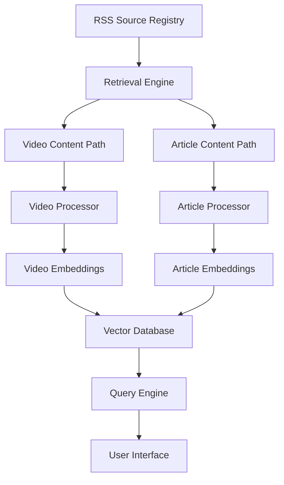

# Lens: Content-Aware Feed Aggregator

## Overview

Lens is a next-gen RSS Feed Reader that uses AI in the backend to make RSS Feeds and other decentralized information easier to work with. The system distinguishes between different content types (particularly video vs. article content) and uses specialized processing paths for each, learning user preferences for topics and content formats over time.

Lens is a next-generation feed aggregator that uses local AI models to intelligently filter, rank, and recommend content from RSS feeds based on user interests.

Lens is a next-gen RSS Feed Reader that is built to use AI to help organize and share RSS feeds, online content, and more.

"Lens is a next-gen RSS Feed Reader that organizes and shares RSS feeds, stories, and information."

"Lens is a next-gen RSS Feed Reader that shares RSS feeds and content and uses AI to help search, summarize and sort information "

"Lens is a next-gen RSS Feed Reader that organizes and shares information like RSS Feeds, online content, and , designed to use AI to help search \

Lens is a next-gen RSS Feed Reader

What makes it next-gen?
It gently uses AI to intelligently search, sort, and recommend new content.

AI again?
AI is built into Lens, not added on later. Lens uses AI on the backend to help you sort, search, and organize your feeds, stories, and more information. 

Built in?
RSS is not a perfect technology by itself. AI might be the missing piece that revitalizes, or even "completes" RSS. There are a lof of great RSS readers that hide or deal with RSS issues in their own ways. Lens does not use AI to fundamentally change the content you read or how you consume it, Lens utilizes AI from a technical standpoint to make your RSS Feeds easier to work with.

What's a Feed Reader?
RSS Feeds are decentralized feeds of online stories, news, and blogs that 

Why haven't I heard of this before?
RSS was a very popular technology for the first generation of people who really enjoyed the internet for what it does best - share information fast and efficiently. The internet became more scattered and noisy, but RSS is still widely available and easy to integrate with all the new ways contnet and info are created and shared online.


 AI is built into the backend of Lens, not added on later. 

 
Lens is a next-gen RSS Feed Reader that uses AI to search, sort, and organize your feeds, stories, and more content. Lens uses AI in the backend to make RSS Feeds and other decentralized information easier to work with.

Privacy-focused, business focused:
Lens is a next-gen RSS Feed Reader that uses AI in the backend to make RSS Feeds and other decentralized information easier to work with.

Cureader/mindfulness focused:
Lens is a next-gen RSS Feed Reader that gently uses AI in the backend to make your feeds and stories easier to organize and discover.

Excitable/AI focused:
Lens is a next-gen RSS Feed Reader that uses AI to intelligently search, sort, and recommend new online content.


## Key Features

- **Content-Type Awareness**: Specialized processing for videos and articles
- **Local AI Processing**: Uses Ollama for privacy-preserving content analysis
- **Natural Language Queries**: Ask for content in plain English
- **Personalized Recommendations**: Learns your preferences over time
- **Command-Line Interface**: Fast, efficient content discovery
- **Functional Programming**: Built with functional programming principles for clarity and maintainability

## Getting Started

### Prerequisites

- [Deno](https://deno.land/) runtime
- [Ollama](https://ollama.ai/) for local AI models
- Recommended models:
  - An embedding model (e.g., nomic-embed-text)
  - A general-purpose LLM (e.g., llama2 or mistral)

### Installation

```bash
# Clone the repository
git clone https://github.com/mpazaryna/lens.git
cd lens

# Update environment variables in .env file
cp .env.example .env

# Optional: Use sample data for development
# Set LENS_DATA_DIR in .env to point to the samples directory:
# LENS_DATA_DIR=/path/to/lens/docs/samples

# Run the tests
deno task test
```

## Sample Data

The project includes sample data in the `docs/samples/` directory that demonstrates the complete data flow through the Lens system. This sample data serves multiple purposes:

- **Documentation**: Illustrates how data is structured and transformed at each stage of processing
- **Development**: Provides real-world examples for testing and developing new features
- **Onboarding**: Helps new developers understand the system without setting up their own data environment
- **Reference**: Shows expected input/output formats for each component

The sample data includes:

- **OPML Files**: Feed subscription lists in OPML format (`docs/samples/opml/`)
- **RSS Feeds**: Parsed feed content in JSON format (`docs/samples/feeds/`)
- **Fetched Content**: HTML content from feed items (`docs/samples/fetched/`)
- **Processed Content**: AI-generated summaries and metadata (`docs/samples/processed/`)

The samples feature real, accessible content from Austin Kleon's blog, allowing developers to see the complete journey from feed subscription to processed content with actual working endpoints.

For detailed information on the sample data structure and how to use it in development, see the [Sample Data Guide](docs/samples/README.md).

## Architecture

Lens uses a modular architecture with specialized processing paths for different content types:



## Development Status

Lens is currently in active development. See the [project roadmap](docs/prd/roadmap.md) for more details on upcoming features and milestones.

## Contributing

Contributions are welcome! Please see our [contributing guidelines](CONTRIBUTING.md) for more information.

## License

This project is licensed under the MIT License - see the [LICENSE](LICENSE) file for details.

## Acknowledgments

- Built with [Deno](https://deno.land/)
- AI capabilities powered by [Ollama](https://ollama.ai/)
- Inspired by traditional RSS readers and modern AI assistants
